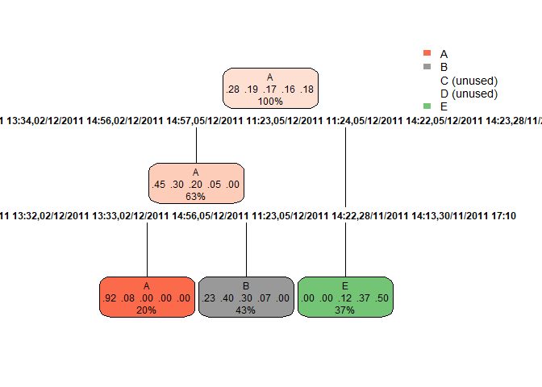
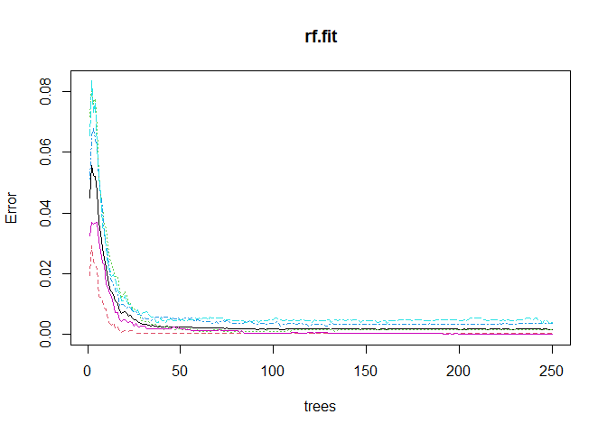

## Synopsis

Using devices such as Jawbone Up, Nike FuelBand, and Fitbit it is now possible to collect a large amount of data about personal activity relatively inexpensively. These type of devices are part of the quantified self movement – a group of enthusiasts who take measurements about themselves regularly to improve their health, to find patterns in their behavior, or because they are tech geeks. One thing that people regularly do is quantify how much of a particular activity they do, but they rarely quantify how well they do it. In this project, your goal will be to use data from accelerometers on the belt, forearm, arm, and dumbell of 6 participants. They were asked to perform barbell lifts correctly and incorrectly in 5 different ways. More information is available from the website here: http://web.archive.org/web/20161224072740/http:/groupware.les.inf.puc-rio.br/har (see the section on the Weight Lifting Exercise Dataset).

## Data

The training data for this project are available here:

https://d396qusza40orc.cloudfront.net/predmachlearn/pml-training.csv

The test data are available here:

https://d396qusza40orc.cloudfront.net/predmachlearn/pml-testing.csv

The data for this project come from this source: http://web.archive.org/web/20161224072740/http:/groupware.les.inf.puc-rio.br/har.

## Analysis

Load required libraries


```r
library(caret)
```

```
## Loading required package: lattice
```

```
## Loading required package: ggplot2
```

```r
library(randomForest)
```

```
## randomForest 4.6-14
```

```
## Type rfNews() to see new features/changes/bug fixes.
```

```
## 
## Attaching package: 'randomForest'
```

```
## The following object is masked from 'package:ggplot2':
## 
##     margin
```

```r
library(rpart)
library(rpart.plot)
```

Load Data


```r
testing_fiename <- "pml-testing.csv"
training_filename <- "pml-training.csv"

if (!file.exists(testing_fiename, training_filename)) {
  testing_fileURL <-
    "https://d396qusza40orc.cloudfront.net/predmachlearn/pml-testing.csv"
  training_fileURL <-
    "https://d396qusza40orc.cloudfront.net/predmachlearn/pml-training.csv"
  download.file(fileURL, fiename)
}
```

```
## Warning in if (!file.exists(testing_fiename, training_filename)) {: the
## condition has length > 1 and only the first element will be used
```

```r
testing  <- read.csv(testing_fiename, na.strings=c("NA","#DIV/0!",""))
training <- read.csv(training_filename, na.strings=c("NA","#DIV/0!",""))
```

Cross-validation will be performed by spliting the training dataset into:

1) A training dataset, containing 70% of the observations. The models for prediction will be built using this dataset.

2) A testing dataset, containing 30% of the observations. The accuracy of our prediction models will be evaluated using this dataset.


```r
# First look at the data
str(training)
```

```
## 'data.frame':	19622 obs. of  160 variables:
##  $ X                       : int  1 2 3 4 5 6 7 8 9 10 ...
##  $ user_name               : chr  "carlitos" "carlitos" "carlitos" "carlitos" ...
##  $ raw_timestamp_part_1    : int  1323084231 1323084231 1323084231 1323084232 1323084232 1323084232 1323084232 1323084232 1323084232 1323084232 ...
##  $ raw_timestamp_part_2    : int  788290 808298 820366 120339 196328 304277 368296 440390 484323 484434 ...
##  $ cvtd_timestamp          : chr  "05/12/2011 11:23" "05/12/2011 11:23" "05/12/2011 11:23" "05/12/2011 11:23" ...
##  $ new_window              : chr  "no" "no" "no" "no" ...
##  $ num_window              : int  11 11 11 12 12 12 12 12 12 12 ...
##  $ roll_belt               : num  1.41 1.41 1.42 1.48 1.48 1.45 1.42 1.42 1.43 1.45 ...
##  $ pitch_belt              : num  8.07 8.07 8.07 8.05 8.07 8.06 8.09 8.13 8.16 8.17 ...
##  $ yaw_belt                : num  -94.4 -94.4 -94.4 -94.4 -94.4 -94.4 -94.4 -94.4 -94.4 -94.4 ...
##  $ total_accel_belt        : int  3 3 3 3 3 3 3 3 3 3 ...
##  $ kurtosis_roll_belt      : num  NA NA NA NA NA NA NA NA NA NA ...
##  $ kurtosis_picth_belt     : num  NA NA NA NA NA NA NA NA NA NA ...
##  $ kurtosis_yaw_belt       : logi  NA NA NA NA NA NA ...
##  $ skewness_roll_belt      : num  NA NA NA NA NA NA NA NA NA NA ...
##  $ skewness_roll_belt.1    : num  NA NA NA NA NA NA NA NA NA NA ...
##  $ skewness_yaw_belt       : logi  NA NA NA NA NA NA ...
##  $ max_roll_belt           : num  NA NA NA NA NA NA NA NA NA NA ...
##  $ max_picth_belt          : int  NA NA NA NA NA NA NA NA NA NA ...
##  $ max_yaw_belt            : num  NA NA NA NA NA NA NA NA NA NA ...
##  $ min_roll_belt           : num  NA NA NA NA NA NA NA NA NA NA ...
##  $ min_pitch_belt          : int  NA NA NA NA NA NA NA NA NA NA ...
##  $ min_yaw_belt            : num  NA NA NA NA NA NA NA NA NA NA ...
##  $ amplitude_roll_belt     : num  NA NA NA NA NA NA NA NA NA NA ...
##  $ amplitude_pitch_belt    : int  NA NA NA NA NA NA NA NA NA NA ...
##  $ amplitude_yaw_belt      : num  NA NA NA NA NA NA NA NA NA NA ...
##  $ var_total_accel_belt    : num  NA NA NA NA NA NA NA NA NA NA ...
##  $ avg_roll_belt           : num  NA NA NA NA NA NA NA NA NA NA ...
##  $ stddev_roll_belt        : num  NA NA NA NA NA NA NA NA NA NA ...
##  $ var_roll_belt           : num  NA NA NA NA NA NA NA NA NA NA ...
##  $ avg_pitch_belt          : num  NA NA NA NA NA NA NA NA NA NA ...
##  $ stddev_pitch_belt       : num  NA NA NA NA NA NA NA NA NA NA ...
##  $ var_pitch_belt          : num  NA NA NA NA NA NA NA NA NA NA ...
##  $ avg_yaw_belt            : num  NA NA NA NA NA NA NA NA NA NA ...
##  $ stddev_yaw_belt         : num  NA NA NA NA NA NA NA NA NA NA ...
##  $ var_yaw_belt            : num  NA NA NA NA NA NA NA NA NA NA ...
##  $ gyros_belt_x            : num  0 0.02 0 0.02 0.02 0.02 0.02 0.02 0.02 0.03 ...
##  $ gyros_belt_y            : num  0 0 0 0 0.02 0 0 0 0 0 ...
##  $ gyros_belt_z            : num  -0.02 -0.02 -0.02 -0.03 -0.02 -0.02 -0.02 -0.02 -0.02 0 ...
##  $ accel_belt_x            : int  -21 -22 -20 -22 -21 -21 -22 -22 -20 -21 ...
##  $ accel_belt_y            : int  4 4 5 3 2 4 3 4 2 4 ...
##  $ accel_belt_z            : int  22 22 23 21 24 21 21 21 24 22 ...
##  $ magnet_belt_x           : int  -3 -7 -2 -6 -6 0 -4 -2 1 -3 ...
##  $ magnet_belt_y           : int  599 608 600 604 600 603 599 603 602 609 ...
##  $ magnet_belt_z           : int  -313 -311 -305 -310 -302 -312 -311 -313 -312 -308 ...
##  $ roll_arm                : num  -128 -128 -128 -128 -128 -128 -128 -128 -128 -128 ...
##  $ pitch_arm               : num  22.5 22.5 22.5 22.1 22.1 22 21.9 21.8 21.7 21.6 ...
##  $ yaw_arm                 : num  -161 -161 -161 -161 -161 -161 -161 -161 -161 -161 ...
##  $ total_accel_arm         : int  34 34 34 34 34 34 34 34 34 34 ...
##  $ var_accel_arm           : num  NA NA NA NA NA NA NA NA NA NA ...
##  $ avg_roll_arm            : num  NA NA NA NA NA NA NA NA NA NA ...
##  $ stddev_roll_arm         : num  NA NA NA NA NA NA NA NA NA NA ...
##  $ var_roll_arm            : num  NA NA NA NA NA NA NA NA NA NA ...
##  $ avg_pitch_arm           : num  NA NA NA NA NA NA NA NA NA NA ...
##  $ stddev_pitch_arm        : num  NA NA NA NA NA NA NA NA NA NA ...
##  $ var_pitch_arm           : num  NA NA NA NA NA NA NA NA NA NA ...
##  $ avg_yaw_arm             : num  NA NA NA NA NA NA NA NA NA NA ...
##  $ stddev_yaw_arm          : num  NA NA NA NA NA NA NA NA NA NA ...
##  $ var_yaw_arm             : num  NA NA NA NA NA NA NA NA NA NA ...
##  $ gyros_arm_x             : num  0 0.02 0.02 0.02 0 0.02 0 0.02 0.02 0.02 ...
##  $ gyros_arm_y             : num  0 -0.02 -0.02 -0.03 -0.03 -0.03 -0.03 -0.02 -0.03 -0.03 ...
##  $ gyros_arm_z             : num  -0.02 -0.02 -0.02 0.02 0 0 0 0 -0.02 -0.02 ...
##  $ accel_arm_x             : int  -288 -290 -289 -289 -289 -289 -289 -289 -288 -288 ...
##  $ accel_arm_y             : int  109 110 110 111 111 111 111 111 109 110 ...
##  $ accel_arm_z             : int  -123 -125 -126 -123 -123 -122 -125 -124 -122 -124 ...
##  $ magnet_arm_x            : int  -368 -369 -368 -372 -374 -369 -373 -372 -369 -376 ...
##  $ magnet_arm_y            : int  337 337 344 344 337 342 336 338 341 334 ...
##  $ magnet_arm_z            : int  516 513 513 512 506 513 509 510 518 516 ...
##  $ kurtosis_roll_arm       : num  NA NA NA NA NA NA NA NA NA NA ...
##  $ kurtosis_picth_arm      : num  NA NA NA NA NA NA NA NA NA NA ...
##  $ kurtosis_yaw_arm        : num  NA NA NA NA NA NA NA NA NA NA ...
##  $ skewness_roll_arm       : num  NA NA NA NA NA NA NA NA NA NA ...
##  $ skewness_pitch_arm      : num  NA NA NA NA NA NA NA NA NA NA ...
##  $ skewness_yaw_arm        : num  NA NA NA NA NA NA NA NA NA NA ...
##  $ max_roll_arm            : num  NA NA NA NA NA NA NA NA NA NA ...
##  $ max_picth_arm           : num  NA NA NA NA NA NA NA NA NA NA ...
##  $ max_yaw_arm             : int  NA NA NA NA NA NA NA NA NA NA ...
##  $ min_roll_arm            : num  NA NA NA NA NA NA NA NA NA NA ...
##  $ min_pitch_arm           : num  NA NA NA NA NA NA NA NA NA NA ...
##  $ min_yaw_arm             : int  NA NA NA NA NA NA NA NA NA NA ...
##  $ amplitude_roll_arm      : num  NA NA NA NA NA NA NA NA NA NA ...
##  $ amplitude_pitch_arm     : num  NA NA NA NA NA NA NA NA NA NA ...
##  $ amplitude_yaw_arm       : int  NA NA NA NA NA NA NA NA NA NA ...
##  $ roll_dumbbell           : num  13.1 13.1 12.9 13.4 13.4 ...
##  $ pitch_dumbbell          : num  -70.5 -70.6 -70.3 -70.4 -70.4 ...
##  $ yaw_dumbbell            : num  -84.9 -84.7 -85.1 -84.9 -84.9 ...
##  $ kurtosis_roll_dumbbell  : num  NA NA NA NA NA NA NA NA NA NA ...
##  $ kurtosis_picth_dumbbell : num  NA NA NA NA NA NA NA NA NA NA ...
##  $ kurtosis_yaw_dumbbell   : logi  NA NA NA NA NA NA ...
##  $ skewness_roll_dumbbell  : num  NA NA NA NA NA NA NA NA NA NA ...
##  $ skewness_pitch_dumbbell : num  NA NA NA NA NA NA NA NA NA NA ...
##  $ skewness_yaw_dumbbell   : logi  NA NA NA NA NA NA ...
##  $ max_roll_dumbbell       : num  NA NA NA NA NA NA NA NA NA NA ...
##  $ max_picth_dumbbell      : num  NA NA NA NA NA NA NA NA NA NA ...
##  $ max_yaw_dumbbell        : num  NA NA NA NA NA NA NA NA NA NA ...
##  $ min_roll_dumbbell       : num  NA NA NA NA NA NA NA NA NA NA ...
##  $ min_pitch_dumbbell      : num  NA NA NA NA NA NA NA NA NA NA ...
##  $ min_yaw_dumbbell        : num  NA NA NA NA NA NA NA NA NA NA ...
##  $ amplitude_roll_dumbbell : num  NA NA NA NA NA NA NA NA NA NA ...
##   [list output truncated]
```

```r
str(testing)
```

```
## 'data.frame':	20 obs. of  160 variables:
##  $ X                       : int  1 2 3 4 5 6 7 8 9 10 ...
##  $ user_name               : chr  "pedro" "jeremy" "jeremy" "adelmo" ...
##  $ raw_timestamp_part_1    : int  1323095002 1322673067 1322673075 1322832789 1322489635 1322673149 1322673128 1322673076 1323084240 1322837822 ...
##  $ raw_timestamp_part_2    : int  868349 778725 342967 560311 814776 510661 766645 54671 916313 384285 ...
##  $ cvtd_timestamp          : chr  "05/12/2011 14:23" "30/11/2011 17:11" "30/11/2011 17:11" "02/12/2011 13:33" ...
##  $ new_window              : chr  "no" "no" "no" "no" ...
##  $ num_window              : int  74 431 439 194 235 504 485 440 323 664 ...
##  $ roll_belt               : num  123 1.02 0.87 125 1.35 -5.92 1.2 0.43 0.93 114 ...
##  $ pitch_belt              : num  27 4.87 1.82 -41.6 3.33 1.59 4.44 4.15 6.72 22.4 ...
##  $ yaw_belt                : num  -4.75 -88.9 -88.5 162 -88.6 -87.7 -87.3 -88.5 -93.7 -13.1 ...
##  $ total_accel_belt        : int  20 4 5 17 3 4 4 4 4 18 ...
##  $ kurtosis_roll_belt      : logi  NA NA NA NA NA NA ...
##  $ kurtosis_picth_belt     : logi  NA NA NA NA NA NA ...
##  $ kurtosis_yaw_belt       : logi  NA NA NA NA NA NA ...
##  $ skewness_roll_belt      : logi  NA NA NA NA NA NA ...
##  $ skewness_roll_belt.1    : logi  NA NA NA NA NA NA ...
##  $ skewness_yaw_belt       : logi  NA NA NA NA NA NA ...
##  $ max_roll_belt           : logi  NA NA NA NA NA NA ...
##  $ max_picth_belt          : logi  NA NA NA NA NA NA ...
##  $ max_yaw_belt            : logi  NA NA NA NA NA NA ...
##  $ min_roll_belt           : logi  NA NA NA NA NA NA ...
##  $ min_pitch_belt          : logi  NA NA NA NA NA NA ...
##  $ min_yaw_belt            : logi  NA NA NA NA NA NA ...
##  $ amplitude_roll_belt     : logi  NA NA NA NA NA NA ...
##  $ amplitude_pitch_belt    : logi  NA NA NA NA NA NA ...
##  $ amplitude_yaw_belt      : logi  NA NA NA NA NA NA ...
##  $ var_total_accel_belt    : logi  NA NA NA NA NA NA ...
##  $ avg_roll_belt           : logi  NA NA NA NA NA NA ...
##  $ stddev_roll_belt        : logi  NA NA NA NA NA NA ...
##  $ var_roll_belt           : logi  NA NA NA NA NA NA ...
##  $ avg_pitch_belt          : logi  NA NA NA NA NA NA ...
##  $ stddev_pitch_belt       : logi  NA NA NA NA NA NA ...
##  $ var_pitch_belt          : logi  NA NA NA NA NA NA ...
##  $ avg_yaw_belt            : logi  NA NA NA NA NA NA ...
##  $ stddev_yaw_belt         : logi  NA NA NA NA NA NA ...
##  $ var_yaw_belt            : logi  NA NA NA NA NA NA ...
##  $ gyros_belt_x            : num  -0.5 -0.06 0.05 0.11 0.03 0.1 -0.06 -0.18 0.1 0.14 ...
##  $ gyros_belt_y            : num  -0.02 -0.02 0.02 0.11 0.02 0.05 0 -0.02 0 0.11 ...
##  $ gyros_belt_z            : num  -0.46 -0.07 0.03 -0.16 0 -0.13 0 -0.03 -0.02 -0.16 ...
##  $ accel_belt_x            : int  -38 -13 1 46 -8 -11 -14 -10 -15 -25 ...
##  $ accel_belt_y            : int  69 11 -1 45 4 -16 2 -2 1 63 ...
##  $ accel_belt_z            : int  -179 39 49 -156 27 38 35 42 32 -158 ...
##  $ magnet_belt_x           : int  -13 43 29 169 33 31 50 39 -6 10 ...
##  $ magnet_belt_y           : int  581 636 631 608 566 638 622 635 600 601 ...
##  $ magnet_belt_z           : int  -382 -309 -312 -304 -418 -291 -315 -305 -302 -330 ...
##  $ roll_arm                : num  40.7 0 0 -109 76.1 0 0 0 -137 -82.4 ...
##  $ pitch_arm               : num  -27.8 0 0 55 2.76 0 0 0 11.2 -63.8 ...
##  $ yaw_arm                 : num  178 0 0 -142 102 0 0 0 -167 -75.3 ...
##  $ total_accel_arm         : int  10 38 44 25 29 14 15 22 34 32 ...
##  $ var_accel_arm           : logi  NA NA NA NA NA NA ...
##  $ avg_roll_arm            : logi  NA NA NA NA NA NA ...
##  $ stddev_roll_arm         : logi  NA NA NA NA NA NA ...
##  $ var_roll_arm            : logi  NA NA NA NA NA NA ...
##  $ avg_pitch_arm           : logi  NA NA NA NA NA NA ...
##  $ stddev_pitch_arm        : logi  NA NA NA NA NA NA ...
##  $ var_pitch_arm           : logi  NA NA NA NA NA NA ...
##  $ avg_yaw_arm             : logi  NA NA NA NA NA NA ...
##  $ stddev_yaw_arm          : logi  NA NA NA NA NA NA ...
##  $ var_yaw_arm             : logi  NA NA NA NA NA NA ...
##  $ gyros_arm_x             : num  -1.65 -1.17 2.1 0.22 -1.96 0.02 2.36 -3.71 0.03 0.26 ...
##  $ gyros_arm_y             : num  0.48 0.85 -1.36 -0.51 0.79 0.05 -1.01 1.85 -0.02 -0.5 ...
##  $ gyros_arm_z             : num  -0.18 -0.43 1.13 0.92 -0.54 -0.07 0.89 -0.69 -0.02 0.79 ...
##  $ accel_arm_x             : int  16 -290 -341 -238 -197 -26 99 -98 -287 -301 ...
##  $ accel_arm_y             : int  38 215 245 -57 200 130 79 175 111 -42 ...
##  $ accel_arm_z             : int  93 -90 -87 6 -30 -19 -67 -78 -122 -80 ...
##  $ magnet_arm_x            : int  -326 -325 -264 -173 -170 396 702 535 -367 -420 ...
##  $ magnet_arm_y            : int  385 447 474 257 275 176 15 215 335 294 ...
##  $ magnet_arm_z            : int  481 434 413 633 617 516 217 385 520 493 ...
##  $ kurtosis_roll_arm       : logi  NA NA NA NA NA NA ...
##  $ kurtosis_picth_arm      : logi  NA NA NA NA NA NA ...
##  $ kurtosis_yaw_arm        : logi  NA NA NA NA NA NA ...
##  $ skewness_roll_arm       : logi  NA NA NA NA NA NA ...
##  $ skewness_pitch_arm      : logi  NA NA NA NA NA NA ...
##  $ skewness_yaw_arm        : logi  NA NA NA NA NA NA ...
##  $ max_roll_arm            : logi  NA NA NA NA NA NA ...
##  $ max_picth_arm           : logi  NA NA NA NA NA NA ...
##  $ max_yaw_arm             : logi  NA NA NA NA NA NA ...
##  $ min_roll_arm            : logi  NA NA NA NA NA NA ...
##  $ min_pitch_arm           : logi  NA NA NA NA NA NA ...
##  $ min_yaw_arm             : logi  NA NA NA NA NA NA ...
##  $ amplitude_roll_arm      : logi  NA NA NA NA NA NA ...
##  $ amplitude_pitch_arm     : logi  NA NA NA NA NA NA ...
##  $ amplitude_yaw_arm       : logi  NA NA NA NA NA NA ...
##  $ roll_dumbbell           : num  -17.7 54.5 57.1 43.1 -101.4 ...
##  $ pitch_dumbbell          : num  25 -53.7 -51.4 -30 -53.4 ...
##  $ yaw_dumbbell            : num  126.2 -75.5 -75.2 -103.3 -14.2 ...
##  $ kurtosis_roll_dumbbell  : logi  NA NA NA NA NA NA ...
##  $ kurtosis_picth_dumbbell : logi  NA NA NA NA NA NA ...
##  $ kurtosis_yaw_dumbbell   : logi  NA NA NA NA NA NA ...
##  $ skewness_roll_dumbbell  : logi  NA NA NA NA NA NA ...
##  $ skewness_pitch_dumbbell : logi  NA NA NA NA NA NA ...
##  $ skewness_yaw_dumbbell   : logi  NA NA NA NA NA NA ...
##  $ max_roll_dumbbell       : logi  NA NA NA NA NA NA ...
##  $ max_picth_dumbbell      : logi  NA NA NA NA NA NA ...
##  $ max_yaw_dumbbell        : logi  NA NA NA NA NA NA ...
##  $ min_roll_dumbbell       : logi  NA NA NA NA NA NA ...
##  $ min_pitch_dumbbell      : logi  NA NA NA NA NA NA ...
##  $ min_yaw_dumbbell        : logi  NA NA NA NA NA NA ...
##  $ amplitude_roll_dumbbell : logi  NA NA NA NA NA NA ...
##   [list output truncated]
```

```r
set.seed(12345)
inTrain = createDataPartition(y=training$classe,p=0.7, list=FALSE)
# training dataset
training.set = training[inTrain,]
# testing dataset
testing.set = training[-inTrain,]
```

Training and testing data consist of 160 variables. The choice of specific predictors is based on removing near zero variance predictors, with the nearZeroVar function, and also variables containing many NAs.


```r
# Remove near zero variance predictors
ind.nzv = nearZeroVar(x = training, saveMetrics = T)
# Remove variables with more than 50% NA values
ind.NA = !as.logical(apply(training, 2, function(x){ mean(is.na(x)) >= 0.5}))
# Cleaning data
ind2 = ind.NA*1 + (!ind.nzv$nzv)*1
ind3 = ind2 == 2
sum(ind3)
```

```
## [1] 59
```

```r
#View(data.frame(ind.NA, !ind.nzv$nzv, ind2, ind3))
training.set = training.set[,ind3]
testing.set = testing.set[, ind3]
training.set = training.set[, -1]
testing.set = testing.set[, -1]
testing = testing[,ind3]
testing = testing[,-1]
# Coerce the data into the same type in order to avoid
# "Matching Error" when calling random forest model, due to different levels in variables
for (i in 1:length(testing) ) {
  for(j in 1:length(training.set)) {
    if( length( grep(names(training.set[i]), names(testing)[j]) ) == 1)  {
      class(testing[j]) <- class(training.set[i])
    }      
  }      
}
# To get the same class between testing and training.set
testing = testing[,-ncol(testing)]
testing <- rbind(training.set[2, -58] , testing)
testing <- testing[-1,]
```

We will use two approaches to create a prediction model for the values of classe variable. 

Firstly prediction with trees will be attempted, using the 'rpart' method and the caret package.


```r
# Prediction with Trees
# Build model
set.seed(12345)
tree.fit = train(y = training.set$classe,
                 x = training.set[,-ncol(training.set)],
                 method = "rpart")
# Plot classification tree
rpart.plot(tree.fit$finalModel)
```

<!-- -->

```r
# Predictions with rpart model
pred.tree = predict(tree.fit, testing.set[,-ncol(testing.set)])
# Get results (Accuracy, etc.)
confusionMatrix(pred.tree, as.factor(testing.set$classe))
```

```
## Confusion Matrix and Statistics
## 
##           Reference
## Prediction    A    B    C    D    E
##          A 1042  108    0    0    0
##          B  632 1023  763  167    0
##          C    0    0    0    0    0
##          D    0    0    0    0    0
##          E    0    8  263  797 1082
## 
## Overall Statistics
##                                           
##                Accuracy : 0.5347          
##                  95% CI : (0.5219, 0.5476)
##     No Information Rate : 0.2845          
##     P-Value [Acc > NIR] : < 2.2e-16       
##                                           
##                   Kappa : 0.4127          
##                                           
##  Mcnemar's Test P-Value : NA              
## 
## Statistics by Class:
## 
##                      Class: A Class: B Class: C Class: D Class: E
## Sensitivity            0.6225   0.8982   0.0000   0.0000   1.0000
## Specificity            0.9744   0.6709   1.0000   1.0000   0.7776
## Pos Pred Value         0.9061   0.3957      NaN      NaN   0.5033
## Neg Pred Value         0.8665   0.9648   0.8257   0.8362   1.0000
## Prevalence             0.2845   0.1935   0.1743   0.1638   0.1839
## Detection Rate         0.1771   0.1738   0.0000   0.0000   0.1839
## Detection Prevalence   0.1954   0.4393   0.0000   0.0000   0.3653
## Balanced Accuracy      0.7984   0.7845   0.5000   0.5000   0.8888
```

Secondly a prediction model using random forest method will be created.


```r
# Prediction with Random Forest
# Build model
set.seed(12345)
rf.fit = randomForest(
  as.factor(classe) ~ .,
  data = training.set,
  ntree = 250)
# Plot the Random Forests model
plot(rf.fit)
```

<!-- -->

```r
# Predict with random forest model
pred2 = predict(
  rf.fit,
  testing.set[,-ncol(testing.set)]
)
# Get results (Accuracy, etc.)
confusionMatrix(pred2, as.factor(testing.set$classe))
```

```
## Confusion Matrix and Statistics
## 
##           Reference
## Prediction    A    B    C    D    E
##          A 1674    0    0    0    0
##          B    0 1139    1    0    0
##          C    0    0 1019    4    0
##          D    0    0    6  960    0
##          E    0    0    0    0 1082
## 
## Overall Statistics
##                                           
##                Accuracy : 0.9981          
##                  95% CI : (0.9967, 0.9991)
##     No Information Rate : 0.2845          
##     P-Value [Acc > NIR] : < 2.2e-16       
##                                           
##                   Kappa : 0.9976          
##                                           
##  Mcnemar's Test P-Value : NA              
## 
## Statistics by Class:
## 
##                      Class: A Class: B Class: C Class: D Class: E
## Sensitivity            1.0000   1.0000   0.9932   0.9959   1.0000
## Specificity            1.0000   0.9998   0.9992   0.9988   1.0000
## Pos Pred Value         1.0000   0.9991   0.9961   0.9938   1.0000
## Neg Pred Value         1.0000   1.0000   0.9986   0.9992   1.0000
## Prevalence             0.2845   0.1935   0.1743   0.1638   0.1839
## Detection Rate         0.2845   0.1935   0.1732   0.1631   0.1839
## Detection Prevalence   0.2845   0.1937   0.1738   0.1641   0.1839
## Balanced Accuracy      1.0000   0.9999   0.9962   0.9973   1.0000
```

The accuracy of the random forest model is, as expected, much higher than the rpart model, over 0.99!

Random Forest model performed better and constitutes the model of choice for predicting the 20 observations of the original pml-testing.csv dataset.


```r
# Get predictions for the 20 observations of the original pml-testing.csv
pred.validation = predict(rf.fit, testing)
pred.validation
```

```
##  1 21  3  4  5  6  7  8  9 10 11 12 13 14 15 16 17 18 19 20 
##  B  A  B  A  A  E  D  B  A  A  B  C  B  A  E  E  A  B  B  B 
## Levels: A B C D E
```


```r
# Saving predictions for testing dataset
testing$pred.classe = pred.validation
write.table(
  testing,
  file = "testing_with_predictions",
  quote = F
)
```
